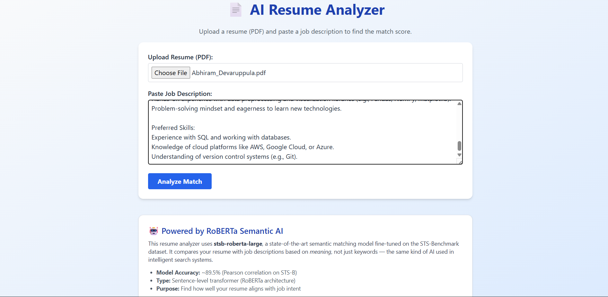

# 🧠 AI Resume Analyzer Using RoBERTa  
### Match Your Resume to Job Descriptions with Skill Gap Analysis

The **AI Resume Analyzer** is an intelligent web application that uses **RoBERTa (stsb-roberta-large)** from SentenceTransformers to automatically evaluate how well a resume matches a job description.  
It provides a **semantic match score**, identifies **matched skills**, highlights **missing keywords**, and gives **smart improvement suggestions** — similar to what ATS (Applicant Tracking Systems) do.

---

## 🚀 Features

### 🔍 Resume Analysis  
- Upload any **PDF resume**  
- Paste a job description  
- AI extracts skills, experience, and keywords  
- RoBERTa calculates **semantic similarity score**

### 📊 Output Includes  
- ✔ Matching skills  
- ❌ Missing key skills  
- 🎯 Skill gap analysis  
- 🧠 Smart suggestions to improve your resume  
- 📈 ATS-friendly scoring mechanism

### 🎨 Modern UI  
- Built using **Tailwind CSS**  
- Clean, responsive interface  
- Simple drag-and-drop resume upload

---

## 🧠 How It Works

This application uses:

### 1️⃣ **RoBERTa (stsb-roberta-large)**  
- Computes embeddings for resume & job description  
- Uses cosine similarity to generate a **match score**

### 2️⃣ **NER (Named Entity Recognition)**  
- Extracts skills, experience, tools, programming languages  
- Compares with job description keywords

### 3️⃣ **Custom Rule-based Suggestion Engine**  
- Identifies missing skills  
- Suggests improvements based on gaps  
- Provides tailored recommendations

---

## 🛠 Tech Stack

| Component | Technology |
|----------|------------|
| Frontend | Tailwind CSS, HTML, Jinja2 |
| Backend | Flask (Python) |
| NLP Models | RoBERTa (SentenceTransformers), BERT NER |
| PDF Parsing | PyMuPDF |
| Deployment | Localhost / Render / PythonAnywhere |
| Version Control | Git & GitHub |

---

## 📂 Project Structure
## 📸 Screenshots

### 🏠 Home Page – Upload Resume & Enter Job Description

  

---

### 📝 Filling Resume & Job Description

  

---

### 📊 Resume Match Result

  

